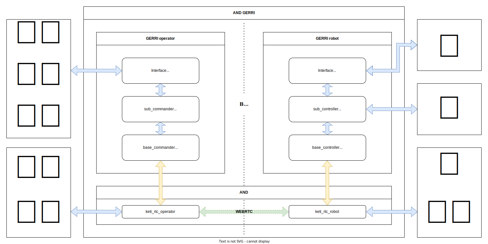

# 🤖 (TOM) AND GERRI

A modular robot teleoperation framework composed of three key components:

- **TOM (Tele Operation Module)**: A physical interface device directly connected to the robot. It acts as the bridge between the robot and GERRI, enabling real-time exchange of robot status and user commands.

- **GERRI (Global Extended Robot Remote Interface)**: A distributed software system split into two parts:
  - **Operator**: Receives user input from various interfaces (e.g. keyboard, VR, master arm), processes commands, and sends them to the robot.
  - **Robot**: Interprets the received commands and executes appropriate hardware-level actions.

- **AND (Adaptive Network Daemon)**: A protocol-agnostic communication module responsible for transporting messages between the operator and the robot. While WebRTC is commonly used, the underlying protocol is not fixed.

Together, TOM, AND, and GERRI provide a scalable and flexible architecture for remote robot control with clear separation of concerns between interface, network, and execution layers.

---


## 🧭 System Overview

Below is a high-level architecture of the Hello Universe robot framework:



## 🗂 Project Structure Overview
```
and_gerri/
├── gerri/                       # Core GERRI Framework
│   ├── operator/                # Operator-side modules
│   │   ├── commander/           # Command generation logic (base/sub)
│   │   ├── interface/           # Input devices (keyboard, VR, etc.)
│   │   ├── examples/            # Per-robot operator implementations
│   │   └── ...                  
│   ├── robot/                   # Robot-side modules
│   │   ├── controller/          # Base/sub controller logic
│   │   ├── interface/           # Robot-side I/O (sensors, estop)
│   │   ├── examples/            # Per-robot controller implementations
│   │   └── ...
├── _and_/                       # Adaptive Network Daemon core
├── utils/                       # Utility scripts
├── hello_universe_*             # Entry scripts for robot/operator
├── requirements.txt             # Python dependencies
├── install.sh                   # Setup script
└── README.md                    # This file
```


## 📦 Quick Start

### 1. Clone the repository

```bash
mkdir ~/dev
cd ~/dev
git clone https://github.com/keti-ai/and_gerri.git # NEED ID and TOKEN
cd and_gerri
```

### 2. Set up the environment (Ubuntu)

```bash
sudo chmod 777 install.sh
bash install.sh
```

This will:
- Install Python 3.10 and system dependencies
- Create a Python virtual environment
- Install dependencies from `requirements.txt`

To activate the environment in a new terminal session:

```bash
source venv/bin/activate
```

---

## 🧠 Architecture Overview

### Operator Side (`gerri/operator/`)

| Directory | Role |
|----------|------|
| `commander/` | Divided into **base** (e.g. `SampleBaseCommander`) and **sub** (e.g. `SampleSubCommander`). SubCommanders define input mappings and send logic to BaseCommanders. |
| `interface/` | Manages input devices like keyboard, VR tracker, master arm. |
| `examples/` | Robot-specific commander logic. |

---

### Robot Side (`gerri/robot/`)

| Directory | Role |
|----------|------|
| `controller/` | Divided into **base** (e.g. `SampleBaseController`) and **sub** (e.g. `SampleSubController`). SubControllers define hardware logic; BaseControllers manage message routing. |
| `interface/` | Deals with sensors, emergency buttons, etc. |
| `examples/` | Robot-specific control logic. |

---

## 🔄 Command Flow

```
[Interface Input (e.g. keyboard)]
     ↓
[SubCommander]
     ↓
[BaseCommander]
     ↓
────────────────────→ via network
                     ↓
              [BaseController]
                     ↓
              [SubController]
                     ↓
           [Robot executes command]
```

---

## 🧩 Custom Robot Integration

### Option 1: Register model in base controller

```python
if robot_model == 'gerri':
  from gerri.robot.examples.sample_robot.sample_sub_controller import SampleSubController

  return SampleSubController()
```

### Option 2: Inject sub-controller manually

```python
from gerri.robot.examples.sample_robot.sample_base_controller import SampleBaseController
from gerri.robot.examples.sample_robot.sample_sub_controller import SampleSubController

robot = SampleBaseController(ROBOT_INFO, controller=SampleSubController())
robot.connect()
```

---

## 🧩 Custom Commander Integration

Supports dependency injection and delayed binding:

```python
sub = SampleSubCommander()
base = SampleBaseCommander(ROBOT_INFO, commander=sub)
base.connect()
```

The `set_base_commander()` method binds both sides after instantiation to avoid circular reference.

---